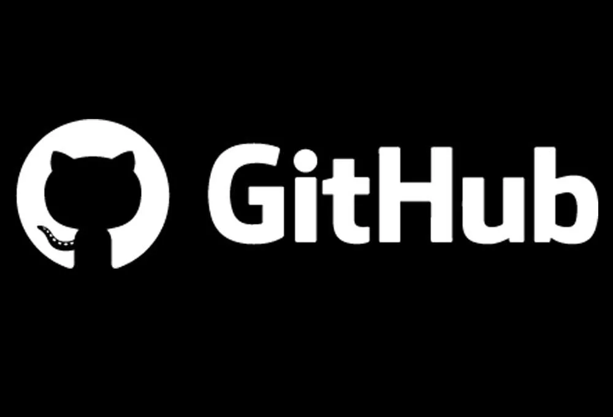

# Краткое руководство по Git

## Git — это распределённая система управления версиями: есть один сервер, через который разработчики обмениваются кодом. Разработчик копирует (клонирует) проект к себе на локальную машину, делает изменения и сохраняет их на удалённый сервер. При необходимости другие разработчики могут скопировать эти изменения к себе.
## 1. Основные команды
 * **git init** - *создание репозитория* **;**
 * **git status** - *выводит информацию о состоянии репозитория* **;**
 * **git config --global user.name(user.email)** - *регистрация в git для отображения в последующих коммитах, отправленных на GitHub*__;__
 * **git add** - *добавить файл для отслеживания в Git*__;__
 * **git diff** - *можно просматривать список изменений, внесённых в репозиторий*__;__
## 2. Работа с ветками
 * **git branch** - *выводит список веток* **;**
 * **git branch_name** - *создает ветку с имененм branch_name* **;**
 * **git checkout branch_name** - *переключает на ветку с именем branch_name* **;** 
 * **git log --grapg** - *выводить журнал в виде графика*__;__
 * **git reset --hard HEAD~** - *удаляет commit и изменения* __;__
 * **git reset head~** - *удаляет commit* __;__
 * **git merge branch_name** - *сливает информацию branch_name с текущей веткой*__;__
 ## 3. Работа с GitHub
 # 
 **GitHub — крупнейший веб-сервис, который позволяет заниматься совместной разработкой с использованием Git и сохранять изменения на своих серверах. На самом деле функциональность GitHub намного больше, но сейчас нас интересует только совместная разработка и история изменений. Ещё есть Gitlab, Bitbucket и другие, но мы будем использовать GitHub как самый популярный в настоящее время.**
 ## Команды для работы с GitHub
 * **git clone** - *создание копии удаленного репозитория* __;__
 * **git push** - *загрузка изменений на удаленный репозиторий* __;__
 * **git pull** - *загрузка изменений с удаленного репозитория* __;__